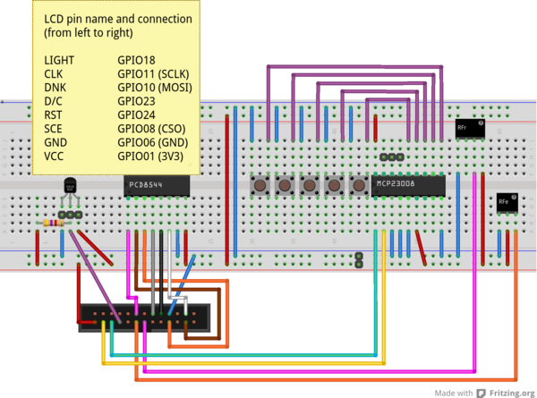

#[RPi-Monitor-LCD](http://rpi-experiences.blogspot.fr/)

###Development still in progress. Repository not ready yet for fork...

## Introduction
**RPi-Monitor-LCD** is designed to display information extracted from [**RPi-Monitor**](https://github.com/XavierBerger/RPi-Monitor) into a [**pcd8544**](https://github.com/XavierBerger/pcd8544) LCD.
Five buttons connected to the Raspberry Pi through i2c bus and [MCP23008](doc/mcp23008.pdf) chip come in addition to the assembly presented into [**pcd8544**](https://github.com/XavierBerger/pcd8544) project. These five buttons are interpreted by **RPi-Monitor-LCD** as UP, DOWN, LEFT, RIGHT and ENTER.

**RPi-Monitor-LCD** is architectured around a finite state machine powered by [fysom](https://github.com/mriehl/fysom). The state machine behavior is highly configurable and is defined into a dedicated configuration file [rpimonitorlcd.conf](rpimonitorlcd.conf). The state machinecan call additionnal libraries to perform custom actions as define into the configuration file.

The project is entended to be a framework easily customizable and not a fully packaged "of-the-shelf" solution. Using **RPi-Monitor-LCD** will certainly require some customization and adaptation (specially if you need to add an additionnal plugins to be called by the state machine).

In this repository **RPi-Monitor-LCD** is provided with an example showing the possibilities offered by finite state machine engine and how it can be implemented. This example call additionnal libraries stored in the subdirectory [plugins](plugins)

## Electronic assembly

**/!\ WARNING: This assembly has not been fully tested yet /!\\**

In the [doc](https://github.com/XavierBerger/RPi-Monitor-LCD/tree/master/doc) directory, you will find an example of implementation working with **RPi-Monitor-LCD**

[](doc/thumb_RPi-Monitor-LCD_bb.png)

**Note**: This electronic assembly comes with additionnal components (DS18B20 temperature sensor and a set of 433MHz components) I plan to use in future projects.

## Installation

Install the dependencies with the following commands:

  * `sudo apt-get install python-dev python-imaging python-imaging-tk python-pip`
  * `sudo pip install wiringpi2`
  * `sudo pip install fysom`
  * `sudo pip install spidev`
  * Install PCD8544 library as follow:

```
git clone https://github.com/XavierBerger/pcd8544.git
cd pcd8544
./setup.py clean build 
sudo ./setup.py install
```

  * Remove `i2c-bcm2708` from `/etc/modprobe.d/raspi-blacklist.conf`
  * Add `i2c-dev` in `/etc/modules`
  * `reboot` or execute `gpio load i2c`
  
##Finite State Machine behavior and configuration

Keyboard and backlight configuration

```
keyboard.repeat=<Nunber of hundredth of a second before key is repeated>
backlight.delay=<Number of seconds to turn light on when key pressed >
```

Initial state for the FSM identified by its unique name &lt;state name&gt;

`fsm.initial=<state name>`

Define the content of a page associated to a &lt;state name&gt;. Each line (identified by a unique line number for the page) defines the python command to be executed to display the page.

`pages.<state name>.content.<line number>=<python command>`

Define event (for a source state, define what is the destination state when a key is pressed)
```
fsm.events.<event id>.name=<key name [up|down|left|right|enter]>
fsm.events.<event id>.src=<state name>
fsm.events.<event id>.dst=<state name>
```

On key pressed callback. This call back is executed during the transition between 2 states. To execute an action without changing the current state, it is required to used the special state named ```action```
```
fsm.<state name>.onup=<python command>
fsm.<state name>.ondown=<python command>
fsm.<state name>.onleft=<python command>
fsm.<state name>.onright=<python command>
fsm.<state name>.onenter=<python command>
```

The special state named ```action``` is designed to execute action and comes back to the initial source state. A specific event prefixed by ```backto``` and followed by the name of the initial source state will be created and configured during the finite state machine initialisation.

##Customisation and plugin creation

The python command used into the configuration file can call additional libraries names plugins. Some plugins are provided inside this repository. If you want to create your own plugin, you should start with the template [plugins/customization.py](plugind/customization.py).

You can etheir implement your code directly inside this file or copy this file to create a new plugin. If you create a new plugin, it will then be required to add the relevant ```import``` into ```rpimonitorlcd``` (The location to add the line is indicated in inline comment).

##Example

Refer to [rpimonitorlcd.conf](rpimonitorlcd.conf) to see an example of implementation. 

The state machine is configured as shown in the diagram bellow:


The initial state is ```logo```. It allow to setup the light and contrast. Once done, hiting ```Enter``` will show the ```Uptime``` page. ```right```, ```enter``` and ```left``` keys allow to navigate between pages.

The example call the additionnal libraries (rpimonitordm.py)[plugins/rpimonitordm.py] and [lcdmanager.py](plugins/lcdmanager.py) which are respectively getting information from **RPi-Monitor** and managing cdl light and contrast.

Another example of library is present: [keypressed.py](plugins/keypressed.py) which is displaying on screen which key has been pressed.
